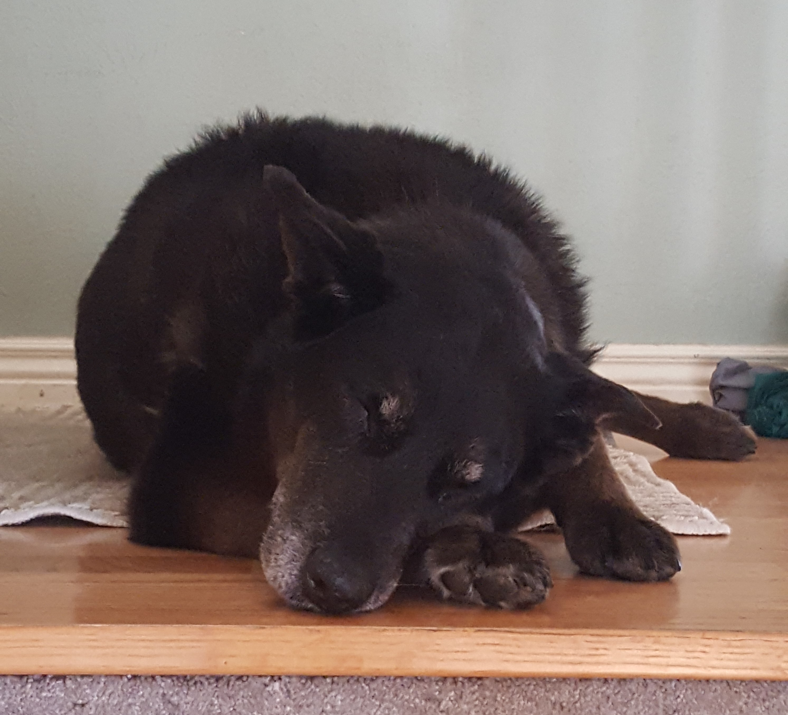

My name is Ethan Skamarock. I was born and raised at the base of the foothills in Boulder, Colorado.

I am currently attending school online at [Lambda School](https://lambdaschool.com/ "Lambda's Homepage") taking classes in data science.

I have an extreme love of dogs. This is my previous dog Troika:

When I am not sitting at my computer struggling with code I am writing or playing videogames with my firends, you may find me outside snowboarding, rock climbing, longboarding, hiking, or playing a round of disc golf.

I hope to rejoin the working world as a Data scientist in the spring/summer of 2020
